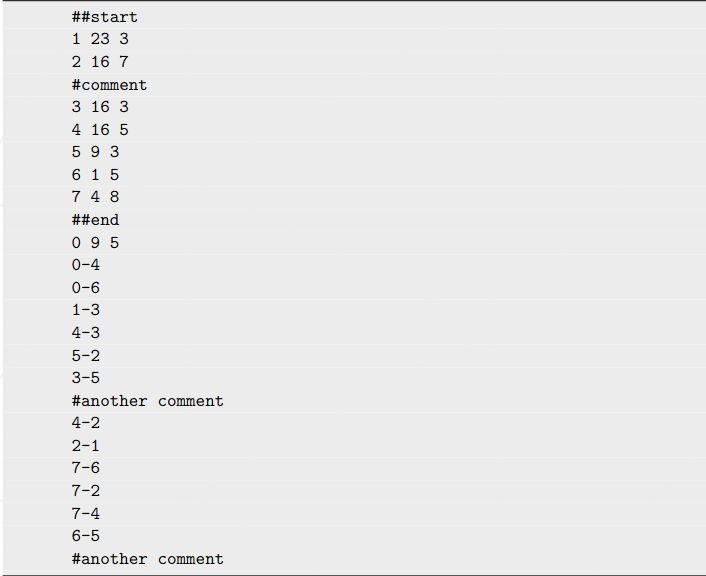
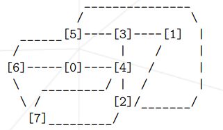
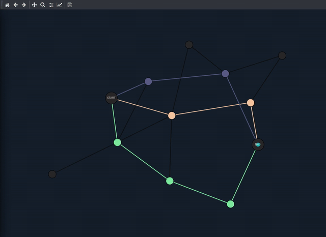
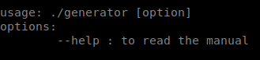
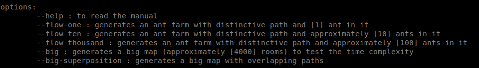
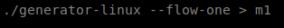
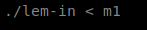
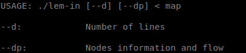

# lem-in

Your ant colony must move from one point to another. But how do you make it take as little time as possible?
This project introduces you to graph traversal algorithms: your program will have to intelligently select the precise paths and movements that must be taken by these ants.

Your program will receive the data describing the ant farm from the standard output in the following format:

The ant farm is defined by the following links:

There are two parts:
◦ The rooms, which are defined by: name coord_x coord_y
◦ The links, which are defined by: name1-name2
◦ All of it is broken by comments, which start with #

Which corresponds to the following representation:

_______________________________________________________________________________________________________________________________________________________________________

 The goal of this project is to find the quickest way to get n ants across the farm.
 
• Quickest way means the solution with the least number of lines, respecting the
output format requested below.

• Obviously, there are some basic constraints. To be the first to arrive, ants will need
to take the shortest path (and that isn’t necessarily the simplest). They will also
need to avoid traffic jams as well as walking all over their fellow ants.

• At the beginning of the game, all the ants are in the room ##start. The goal is
to bring them to the room ##end with as few turns as possible. Each room can
only contain one ant at a time. (except at ##start and ##end which can contain
as many ants as necessary.)

• We consider that all the ants are in the room ##start at the beginning of the game.

• At each turn you will only display the ants that moved.

• At each turn you can move each ant only once and through a tube (the room at
the receiving end must be empty).

generate a map

executing lem-in

